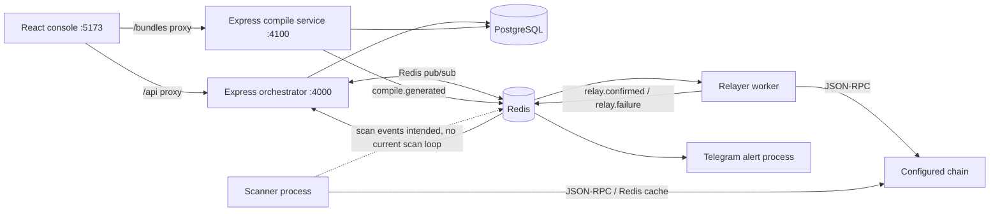

# Project Details

Audit date: 2026-10-06. This document describes the implementation present in this repository, not every feature described in the older `/PROJECT.md` specification. Source, manifests, and infrastructure configuration take precedence over aspirational documentation.

## 1. Repository Summary

- Repository: `lackx741-tech/Sov3`; package name: `aegis-void` (version `0.1.0`).
- A private npm-workspaces JavaScript/TypeScript project with a React console and Node.js services.
- Current overall state: **PARTIALLY FUNCTIONAL**. A local campaign-to-embed flow and both user-signed and operator-signed relay paths can be exercised, but scanning is idle, account authorization is not isolated, default credentials/secrets are unsafe, and no production deployment is defined.

## 2. Technical Intent

The implemented system is a self-hosted console and service set for recording domains, contracts, and campaigns; generating a wallet-connect embed; relaying signed transactions; and emitting operator alerts. PostgreSQL stores application records, Redis provides pub/sub and cache/idempotency state, and the console communicates with the orchestrator and compile service. The repository also contains a scanner whose chain-read helpers are not connected to a scan loop.

## 3. Current Repository Status

- Functional local paths: authentication/login with the seeded development account, domain/contract/campaign CRUD subset, compile event → bundle, user-signed transaction broadcast, and operator-key relay event path.
- Partial/stub paths: scanner target execution, NFT floor-price lookup, Telegram commands, API-key lifecycle, and deployment/operations.
- Not production ready: the checked-in schema creates a known default login; registration is public; authenticated data routes do not scope records to the current user; JWT signing has an insecure fallback; dependencies report advisories.
- Older `PROJECT.md` describes capabilities such as Flashbots, RainbowKit, remote Telegram commands, Kubernetes, and broader scanning that are not implemented in the executable code.

## 4. Technology Stack

| Area | Evidence-based stack |
|---|---|
| Runtime | Node.js `>=20` (`package.json`); tested here on Node.js 24.21.0 |
| Package manager | npm workspaces; `package-lock.json`; npm 11.19.0 used for this audit |
| Backend | JavaScript ES modules; Express 4.19.x; PostgreSQL client `pg` 8.x |
| Frontend | React 18.3.x, TypeScript 5.6.x, Vite 5.4.x |
| Blockchain | ethers.js 6.x; JSON-RPC; Ganache 7.9.x for integration tests |
| Events/cache | Redis 7 container; ioredis 5.x pub/sub and cache |
| Auth/security packages | jsonwebtoken 9.x, bcryptjs 2.x, helmet 7.x, cors 2.x, express-rate-limit 7.x, compression 1.x, crypto-js 4.x |
| Data store | PostgreSQL 15 container, SQL schema in `infra/init.sql`; no ORM or migration framework |
| Tests | Vitest 4.x; shell/Node E2E scripts |
| Build | TypeScript project build plus Vite production build for the console; other workspaces have no build scripts |
| Deployment | Docker Compose only for local PostgreSQL/Redis; no app Dockerfiles, orchestration manifests, or production deploy configuration found |

These are manifest ranges/locked versions, not independently supported versions for external infrastructure. No framework version is inferred beyond package manifests and lockfile.

## 5. Architecture

The console's Vite development server proxies `/api` to the orchestrator and `/bundles` to compile. The orchestrator persists records and publishes compile/relay events. Compile reads campaign/domain/contract data from PostgreSQL and generates JavaScript using `packages/compile/src/generate-embed.js`. The relayer subscribes to Redis topics and uses ethers with the configured JSON-RPC provider. Telegram subscribes to selected topics and calls the Bot API when configured.

## 6. Directory Structure

| Path | Responsibility |
|---|---|
| `packages/orchestrator` | Express API, JWT login, campaigns/domains/contracts, key creation, relay job coordination |
| `packages/compile` | Embed generator, preview and bundle HTTP endpoints |
| `packages/relayer` | Redis subscriber for transaction relay events; chain broadcast/signing |
| `packages/scanner` | JSON-RPC/Redis read helpers and currently idle entry point |
| `packages/shared` | Redis pub/sub event mesh and a shared configuration helper |
| `packages/telegram` | Operator event alert publisher |
| `packages/console` | React/TypeScript dashboard and Compile Lab |
| `infra` | Postgres/Redis Compose definition, initial SQL, and smoke/chain test scripts |
| `.github/workflows` | GitHub Actions build/test/integration workflow |

## 7. Major Components

| Component | Purpose, interfaces, dependencies, state |
|---|---|
| Orchestrator — `packages/orchestrator/src/index.js`, `db.js` | Express API on port 4000; PostgreSQL via `pg`; Redis event mesh; issues JWTs and handles campaigns, domains, contracts, API-key creation, compile triggers, relay requests/status. Several routes are authenticated, but there is no per-user resource ownership enforcement. **PARTIAL** |
| Vault — `packages/orchestrator/src/vault.js` | Generates API keys and encrypts/decrypts them with CryptoJS AES and a `VAULT_KEY`. Key creation/listing exists; decrypt, use, and revocation endpoints are absent. **PARTIAL** |
| Compile — `packages/compile/src/index.js`, `generate-embed.js` | Reads PostgreSQL campaign data; serves `/bundles/:campaignId.js` and preview; embeds configuration and an Ethers-based transaction UI. The WalletConnect choices share the EthereumProvider path; injected provider is supported. RainbowKit is not present. **PARTIAL** |
| Relayer — `packages/relayer/src/index.js` | Subscribes to `relay.broadcast.request` for already signed raw transactions and `relay.relay.request` for operator-key signing; broadcasts through standard JSON-RPC, waits confirmations, retries selected transient errors. Operator-key signing has no orchestrator HTTP route in this repository. **PARTIAL** |
| Scanner — `packages/scanner/src/index.js` | Defines cached balance, ERC-20 allowance, and placeholder NFT-floor helpers. `main()` reads `SCAN_TARGETS` only to log idle status and publish an empty completion event; it never invokes the helpers or emits `scan.intel`. **STUB/PARTIAL** |
| Shared event mesh — `packages/shared/src/events.js` | Redis pub/sub wrapper and topic constants, with subscription readiness and close methods. **COMPLETE for its implemented pub/sub scope** |
| Telegram — `packages/telegram/src/index.js` | Maps scan-completed, relay, compile, and deployment topics to Bot API text alerts. No inbound bot updates, authorization, command handler, or retry queue. **PARTIAL** |
| Console — `packages/console/src/App.tsx` | Login, dashboard, campaign setup, compile configuration, preview/copy/download, and relay job display. Token stored in browser `localStorage`; no frontend tests. **PARTIAL** |

## 8. Runtime / Execution Flow

1. Install dependencies with `npm ci` (or `npm install`).
2. Start local dependencies with `npm run db:up` (or `npm run db:start`, which also attempts to start `dockerd` using passwordless sudo).
3. The PostgreSQL image runs `infra/init.sql` only on initial data-directory creation. It seeds the development login. Runtime code additionally creates `relay_jobs` and `scan_intel` if absent.
4. Set PostgreSQL connection configuration (`POSTGRES_URL` preferred; `DATABASE_URL` fallback) and any service-specific settings. Redis defaults to local `127.0.0.1:6379`.
5. Run each service in its own process using the npm scripts below. Vite runs the console in development; its proxy targets default to local service ports.
6. Compile triggers are Redis pub/sub events; bundle requests are generated on demand from database campaign/config state.
7. Production start and deployment commands: **UNKNOWN — insufficient repository evidence.** No production process manager, backend build artifact, service container definitions, or deployment manifests exist.

The described flow is verified by `infra/e2e-test.mjs` and `infra/relay-e2e.mjs`, not by the aspirational architecture text alone.

## 9. Feature Status

| Feature | Classification | Evidence |
|---|---|---|
| Login, JWT verification, bcrypt password registration | Implemented with blocking security gaps | `packages/orchestrator/src/index.js:107-155`; open registration and default credentials remain |
| Domain and contract records | Implemented, validation/ownership incomplete | `packages/orchestrator/src/index.js:157-196` |
| Campaign create/list/config and compile request | Partially implemented | `packages/orchestrator/src/index.js:220-266`; status changes to `forged`, no full deploy/monitor lifecycle |
| Embed bundle + browser wallet modal | Partially implemented | `packages/compile/src/generate-embed.js:116-180,219-346`; browser-wallet compatibility and real-wallet end-to-end behavior are not comprehensively tested |
| Domain lock | Implemented as client-side hostname/origin check and server-checked claimed origin | `packages/compile/src/generate-embed.js:148-155`; `packages/orchestrator/src/index.js:288-298`; claimed origin is not proof of request origin |
| User-signed raw transaction relay | Implemented; policy checks incomplete | `packages/orchestrator/src/index.js:268-315`; raw transaction is not checked against campaign transaction config |
| Operator-owned wallet relay | Worker implementation exists; API integration absent | `packages/relayer/src/index.js:72-107,149-167`; the repository test publishes directly to Redis |
| Scanner balances/allowances | Helpers only; not invoked by entry point | `packages/scanner/src/index.js:18-44,57-64` |
| NFT floor prices | Stub | `packages/scanner/src/index.js:46-55` always returns null without an oracle |
| Telegram alerts | Partial, only outbound alert messages | `packages/telegram/src/index.js:20-57` |
| Telegram remote commands | Referenced in `PROJECT.md`, missing in source | No inbound polling/webhook or command parser in `packages/telegram` |
| Flashbots/private mempool, RainbowKit, OAuth/refresh tokens, Kubernetes | Referenced in `PROJECT.md`, not implemented | No corresponding integration/configuration in source or manifests |
| API-key lifecycle | Partial | Create/list routes exist; no reveal/decrypt/use/revoke route despite schema fields |

## 10. API Surface

Orchestrator routes are defined in `packages/orchestrator/src/index.js`; API rate limiting applies to `/api` at 200 requests per minute per limiter instance.

| Method and path | Auth | Behavior / caveat |
|---|---|---|
| `POST /api/auth/login` | No | Login and JWT issue; seeded fallback password path exists |
| `POST /api/auth/register` | No | Creates a user with default `operator` role and issues JWT |
| `GET /api/auth/me` | JWT bearer | Returns token subject/email/role |
| `GET, POST /api/domains` | JWT bearer | List/create; no URL/origin ownership validation |
| `GET, POST /api/contracts` | JWT bearer | List/create; no address/chain/ABI validation |
| `GET, POST /api/campaigns` | JWT bearer | List/create; no per-user filtering |
| `GET, PATCH /api/campaigns/:id/config` | JWT bearer | Read/update config; limited schema validation |
| `POST /api/campaigns/:id/compile` | JWT bearer | Publishes compile event if campaign has a domain |
| `POST /api/keys`, `GET /api/keys` | JWT bearer | Create (plaintext returned once), list unrevoked metadata |
| `POST /api/relay/broadcast` | No | Accepts `campaignId`, `rawTx`, claimed origin, function name; claimed domain compared but transaction target/data/chain are not bound to campaign configuration |
| `GET /api/campaigns/:campaignId/relay/:jobId` | No | Job detail lookup by job and campaign IDs |
| `GET /api/campaigns/:campaignId/relay` | JWT bearer | Lists recent campaign jobs |

Compile routes: unauthenticated `GET /bundles/:campaignId.js` serves generated code; `GET /api/campaigns/:campaignId/preview` serves JSON or raw JavaScript. No API versioning or explicit input schema library is configured.

## 11. Database / State

- PostgreSQL schema: `infra/init.sql`; tables are `users`, `contracts`, `domains`, `campaigns`, `compile_logs`, `telegram_alerts`, `api_keys`, `relay_jobs`; orchestrator creates `scan_intel` and `relay_jobs` at startup if missing.
- Foreign keys connect campaigns to contracts/domains/users and compile/relay records to campaigns. Campaign config and contract ABI use JSONB.
- Initial schema does not enforce per-user ownership on campaigns/domains/contracts/API keys. Route queries are generally global.
- No versioned migration system, seed workflow, backup/restore procedure, explicit pool limits, or documented production persistence policy.
- Redis stores pub/sub topics plus scanner cache entries (`bal:`, `allow:`, `floor:`) and relayer keys (`nonce:inflight:`, `relay:claimed:`). Redis runs without authentication/persistence settings in local Compose.
- The relayer nonce helper computes `pending chain nonce + Redis inflight count`; this helper is not used by user-signed raw broadcasts. Reliability under multiple workers/restarts is not established by current tests.

## 12. External Integrations

| Integration | Use and status |
|---|---|
| PostgreSQL | Required for orchestrator and compile service records; local Compose uses PostgreSQL 15 |
| Redis | Event bus and cache; local Compose uses Redis 7 |
| JSON-RPC / ethers | Scanner and relayer default to local RPC URL; scanner's read helpers are not called; relayer uses standard broadcast |
| WalletConnect Ethereum Provider | Dynamically imported from configurable CDN at runtime; requires embed config project ID |
| Injected browser wallet | `window.ethereum` path in generated script |
| Telegram Bot API | Optional outbound alerts when token and chat ID exist |
| Ganache | Local chain provider used by `infra/relay-e2e.mjs` and `infra/chain-e2e.mjs` |
| Flashbots, NFT marketplace feeds, external price oracle, KMS/HSM, OAuth provider | **UNKNOWN — insufficient repository evidence** of an implemented integration |

## 13. Environment Variables

Names and purposes are derived from code and `.env.example`; values are intentionally omitted.

| Variable | Consumer / purpose | Requiredness and default |
|---|---|---|
| `POSTGRES_URL` | Orchestrator and compile PostgreSQL connection | Required in practice; falls back to `DATABASE_URL`; no startup validation |
| `DATABASE_URL` | Fallback PostgreSQL URL | Required if `POSTGRES_URL` absent |
| `REDIS_URL` | Shared event mesh, scanner, relayer, Telegram | Defaults to local Redis URL |
| `JWT_SECRET` | Orchestrator JWT signing/verification | Defaults to insecure literal; must be replaced and startup must fail closed |
| `JWT_EXPIRES_IN` | JWT expiry | Defaults to `15m` |
| `VAULT_KEY` | Orchestrator API-key encryption | Required to create API keys; otherwise route returns 500; no format/strength validation |
| `COMPILE_BASE_URL` | Assigned to orchestrator `compileBase` | Default local compile URL; current route flow publishes through Redis instead; config value appears unused |
| `ORCHESTRATOR_URL` | Base URL embedded in compile script endpoints | Defaults to local orchestrator URL |
| `PUBLIC_ORIGIN` | URL prefix stored for generated bundle links | Defaults to `*`, which is not a useful production origin |
| `PORT` | Orchestrator or compile listener | Defaults to 4000 / 4100 respectively |
| `RPC_URL` | Scanner/relayer JSON-RPC provider | Defaults to local node URL; required for useful chain access |
| `SCAN_TARGETS` | Scanner startup target JSON | Defaults to empty array; currently only changes the idle log |
| `RELAYER_PRIVATE_KEY` | Optional operator wallet signer | Not required for user-signed raw relay; only loaded from process environment |
| `RELAY_CONFIRMATIONS` | Relayer confirmation depth | Defaults to 1 |
| `MAX_FEE_CAP_GWEI` | Operator relayer fee cap | Defaults to 500 |
| `RELAY_MAX_RETRIES`, `RELAY_RETRY_BASE_MS` | Retry count and base delay | Defaults to 3 and 500 ms |
| `TELEGRAM_BOT_TOKEN`, `TELEGRAM_CHAT_ID` | Telegram outbound alerts | Optional; missing values disable sending |
| `VITE_ORCHESTRATOR_URL`, `VITE_COMPILE_URL` | Vite development proxy destinations | Default local service URLs |
| `NODE_ENV` | Listed in `.env.example` | No use found in service source |

`.env.example` omits several code-consumed settings, including `COMPILE_BASE_URL`, Vite proxy overrides, and relayer/scanner tuning values. It is a template, not a validated configuration schema.

## 14. Authentication & Authorization

- Login verifies bcrypt hashes except for a hard-coded placeholder password branch for the seeded operator in `infra/init.sql`.
- Registration is unauthenticated and creates users with the default `operator` role.
- JWT secret defaults to `dev-insecure-secret`; bearer tokens are checked by `auth()` in the orchestrator.
- Campaign/domain/contract/key list and mutation routes require a valid JWT but do not constrain records by `req.user.sub`; all registered users can access shared records.
- `/api/relay/broadcast`, bundle serving, compile preview, and relay job status are public by design/code. Relay-domain checking uses a caller-supplied origin value; HTTP `Origin`/`Referer` are only fallback inputs.
- Console stores bearer token in `localStorage`.
- RBAC, isolated tenant authorization, secure account bootstrap, refresh/revocation, MFA, and password reset: **UNKNOWN — insufficient repository evidence**.

## 15. Security Status

Findings are defensive audit observations; no exploitation was performed.

| Severity | Finding and evidence |
|---|---|
| **CRITICAL** | Initial database inserts `operator@example.com` with a known `change-me` password placeholder, and login explicitly accepts it; console pre-fills the same credentials. `infra/init.sql:82-85`, `packages/orchestrator/src/index.js:125-138`, `packages/console/src/App.tsx:39-53`. |
| **CRITICAL** | JWT signing falls back to a fixed public development secret when `JWT_SECRET` is absent. `packages/orchestrator/src/index.js:15-22,107-110`. |
| **CRITICAL** | Public registration creates `operator` accounts, while authenticated data routes query shared global records without ownership checks. `packages/orchestrator/src/index.js:140-155,157-234`. |
| **HIGH** | Public relay endpoint accepts a raw transaction based on campaign existence and caller-claimed origin, but does not verify raw transaction chain, destination, calldata, or value against that campaign's configured intent. `packages/orchestrator/src/index.js:268-315`. |
| **HIGH** | `cors()` is installed without an origin allowlist; default JWT and open registration amplify the exposure. `packages/orchestrator/src/index.js:28-32,41`. |
| **HIGH** | `npm audit` reported 44 advisories in the installed lockfile dependency tree: 6 critical, 25 high, 12 moderate, and 1 low. This does not by itself establish exploitability; evaluate production reachability and update compatible affected packages. |
| **MEDIUM** | Environment configuration is not validated at startup; missing database URLs fail later, missing `VAULT_KEY` fails only when creating a key, and compile defaults `PUBLIC_ORIGIN` to `*`. |
| **MEDIUM** | Browser JWT in `localStorage` is accessible to same-origin script execution. |
| **MEDIUM** | Domain origins, contract addresses, chain IDs, campaign config, and raw-transaction fields have limited server-side validation. |
| **MEDIUM** | Local Compose publishes PostgreSQL and Redis ports and uses fixed development credentials; do not expose this configuration as production infrastructure. |
| **INFORMATIONAL** | `crypto-js` is a direct dependency used for API-key encryption/generation; npm reports it as discontinued. Review the encryption construction and key derivation before production use. |

No evidence of an implemented CSP policy, TLS termination, production secret manager, Redis ACL/TLS, request audit log, or dependency update automation was found. Secret values are not reproduced here.

## 16. Testing Status

- Vitest files: `packages/compile/test/generate-embed.test.mjs` and `packages/shared/test/events.test.mjs`; current run: **17 passed**.
- `infra/e2e-test.mjs`: login → domain/contract/campaign → compile event → domain-locked bundle; passed.
- `infra/relay-e2e.mjs`: API to user-signed transaction broadcast and job confirmation; passed.
- `infra/chain-e2e.mjs`: operator-signed and user-signed local-chain relay plus idempotency; passed.
- No direct unit/integration tests exist for orchestrator routes/authz, scanner, Telegram, or console UI.
- Redis is required for the shared pub/sub tests. With Redis unavailable during this audit, three pub/sub tests timed out rather than being skipped, despite the test comment describing a skip-on-unavailable behavior. With Redis available, all 17 tests passed.
- Vitest has no coverage reporting configuration; no numerical coverage claim is made.

## 17. Build Status

- `npm ci`: **PASS**; lockfile install completed. npm reported 44 dependency advisories.
- `npm run build`: **PASS**; runs the console TypeScript build and Vite production build. Other workspaces have no build scripts and are skipped via `--if-present`.
- Ganache emitted a µWS native-binary compatibility warning on Node 24 during local-chain tests, then fell back to JavaScript and completed successfully.
- No independent backend type-check, lint, static analysis, or production packaging command is configured.

## 18. Deployment Architecture

Local infrastructure is defined by `infra/docker-compose.yml` (PostgreSQL 15, Redis 7, named Postgres volume, initial SQL). Services are run as separate Node processes using workspace scripts. CI runs on Ubuntu with Node 20 and starts the Compose dependencies. No Dockerfile for application services, production Compose profile, Kubernetes/Helm/Swarm manifests, reverse-proxy/TLS configuration, secrets-management integration, or deployment workflow exists. Production topology and release process: **UNKNOWN — insufficient repository evidence**.

## 19. Observability

- Services log plain text through `console.log`/`console.error`.
- Orchestrator and compile provide central HTTP error handlers; orchestrator also listens for unhandled rejections.
- Telegram can send event text to a configured bot/chat.
- No health/readiness/liveness endpoint, structured logger, metrics exporter, tracing/correlation IDs, alert retry policy, log retention, or graceful shutdown handling was found.
- Event consumers catch some persistence errors and log them; there is no durable event queue or general dead-letter/replay mechanism.

## 20. Known Broken Areas

1. Scanner does not run scans: target helpers are never called, `SCAN_TARGETS` contents are not processed, and no `scan.intel` events are produced by its entry point.
2. First-time developer test execution without Redis fails by timing out in three pub/sub tests, despite the test's documented skip intent.
3. JWT-authenticated routes are not user/tenant isolated; an account is not an authorization boundary.
4. The compile configuration's `broadcastMode: wallet` path uses `eth_sendTransaction`, but wallet compatibility and full browser interaction are not covered by tests.
5. Generated WalletConnect import depends on a runtime CDN; there is no pinned/self-hosted bundle or runtime availability fallback.

## 21. Incomplete Implementations

- Scanner target scheduler and scan-intel publication.
- NFT floor-price oracle.
- Telegram inbound remote command handling and alert durability.
- Full campaign lifecycle beyond draft/forged; no deployment/monitor transition API.
- API-key reveal/use/revoke lifecycle.
- Operator-owned transaction API path; current relayer topic is exercised by direct event publication in a test.
- Campaign-bound relay transaction validation and verified origin proof.
- Database migrations and production database lifecycle/backup operations.
- Production-ready auth bootstrap, ownership/RBAC, environment validation, and deployment.

## 22. Technical Debt

- One large console component (`packages/console/src/App.tsx`) contains login, dashboard, and Compile Lab.
- Two parallel database variable names and unused shared `readConfig`/`compileBase` config obscure effective settings.
- Dependencies have advisories; `crypto-js` is deprecated/discontinued; Ganache causes a native-binary warning on the audited Node 24 runtime.
- Runtime schema creation is split between `infra/init.sql` and orchestrator startup DDL.
- API request validation, data access scoping, error telemetry, and shutdown/resource lifecycle are not consistently centralized.
- README and PROJECT.md contain architecture/spec language beyond the running implementation; keep this audit source-grounded.

## 23. Production Readiness Matrix

| Category | State | Basis |
|---|---|---|
| Build | READY | Console build and TypeScript check pass; no backend build is defined |
| Configuration/secrets | BLOCKED | Insecure JWT fallback, weak seeded password, absent required-setting validation |
| Security/authz | BLOCKED | Open registration, global resource access, unbound raw relay input |
| Database/state | NEEDS WORK | Local schema works; no versioned migrations, backup plan, or production lifecycle |
| Tests | NEEDS WORK | Existing tests and E2E pass with services, but critical route/scanner/UI paths lack tests |
| Dependencies | BLOCKED | `npm audit` reports critical/high advisories requiring triage |
| Deployment | BLOCKED | No production deployment or service packaging definition |
| Reliability/recovery | NEEDS WORK | Redis is central, no health/readiness or graceful shutdown, limited retry/durability |
| Observability | NEEDS WORK | Plain console logs and optional Telegram alerts only |
| CI/CD | NEEDS WORK | Workflow defines build/tests/smoke integration; no production release/deploy pipeline |
| Scalability | NEEDS WORK | Single Redis/Postgres local topology; no service discovery or capacity/recovery configuration |
| **Overall** | **PARTIALLY FUNCTIONAL** | Local tested flows work, but critical security/deployment gaps block safe production use |

## 24. Production Blockers

1. Remove default `change-me` account/password path and require secure first-operator provisioning.
2. Remove insecure JWT signing fallback and fail closed when production secrets/configuration are missing.
3. Restrict public account registration or provide explicit role assignment, and enforce resource ownership/authorization on all operator routes.
4. Triage and remediate applicable critical/high dependency advisories before deploying affected packages.
5. Define and validate a production deployment/configuration path, including TLS, protected secrets, database/Redis access, and operational lifecycle.

## 25. Prioritized Engineering Tasks

| Priority | Task | Component | Reason | Dependency | Validation | Status |
|---|---|---|---|---|---|---|
| P0 | Remove the seeded shared `change-me` credential and login fallback; replace it with an explicit first-operator provisioning flow and remove default credentials from the console. | `infra/init.sql`, orchestrator auth, console | Anyone with the checked-in default can authenticate to a fresh database. | Secure bootstrap decision | Fresh database cannot login with default credentials; bootstrap/login tests pass. | TODO |
| P0 | Require a high-entropy `JWT_SECRET` in production and fail startup rather than signing with `dev-insecure-secret`; document the required name without exposing values. | `packages/orchestrator/src/index.js`, environment docs | Fixed JWT signing key permits token forgery when deployment omits the variable. | Configuration validation | Startup fails without secret; valid configured secret signs/verifies tokens; tests pass. | TODO |
| P0 | Disable open operator registration by default and enforce user/tenant ownership on domain, contract, campaign, key, config, and relay-job routes; assign least-privilege roles explicitly. | Orchestrator routes and schema | Any registered user currently receives operator role and can query/mutate global records. | Ownership/schema policy | Multi-user tests prove cross-account reads/writes are denied and registration cannot self-assign operator access. | TODO |
| P0 | Triage the 44 `npm audit` findings against runtime exposure, then update direct/transitive dependencies to supported patched compatible releases and re-run the audit. | `package.json`, workspace manifests, lockfile | Audit found 6 critical and 25 high advisories in the resolved dependency tree. | Compatibility review | `npm audit` severity report and full test/build/E2E validation recorded. | TODO |
| P0 | Specify and validate a supported production deployment profile covering service runtime, TLS termination, secret injection, external database/cache endpoints, and process lifecycle; do not deploy the local Compose profile as production. | `infra`, service startup, operations docs | The repository defines local data services but no application deployment or production operations. | Deployment target and operator requirements | A clean staging deployment starts all required services with production-safe configuration and passes health/integration checks. | BLOCKED |
| P1 | Validate relay raw transaction chain ID, sender/signature, destination, calldata, and value against the selected campaign policy; do not treat caller-supplied origin as proof of origin. | Orchestrator relay endpoint, compile config | Public relay route only checks campaign existence and a claimed origin. | Campaign policy and wallet-signing compatibility | Negative tests for mismatched transaction fields/origins; positive signed-transaction E2E. | TODO |
| P1 | Add schema validation and input bounds for registration, origins, contract addresses/chain IDs/ABIs, campaign configs, and relay payloads. | Orchestrator API | Current checks mostly test required-field presence. | Validation policy | Route tests for malformed, oversized, and boundary inputs. | TODO |
| P1 | Add route-level authn/authz integration tests, including default setup, registration, shared-resource isolation, and public endpoints. | Orchestrator tests | Central API security behavior currently has no test suite. | P0 auth model | Vitest/API tests run in CI against disposable Postgres. | TODO |
| P1 | Implement the scanner loop for configured target types and publish validated `scan.intel`; remove unsupported target claims or make them explicit until implemented. | Scanner and shared events | Current scanner never reads configured targets. | Target schema and event contract | Tests for balance/allowance results, cache, invalid target handling, and emitted event. | TODO |
| P1 | Add explicit inbound Telegram command policy or remove remote-command claims; authorize every command by configured operator identity. | Telegram | Existing implementation only sends outbound alerts. | Product/API command policy | Command authorization and disabled-config tests. | TODO |
| P1 | Add startup configuration validation and normalized config shared by services; ensure production origins are explicit rather than `*`. | Shared/config, orchestrator, compile, scanner, relayer | Missing settings otherwise fail at runtime or silently use unsafe defaults. | P0 JWT policy | Unit tests for missing/invalid values and successful dev/prod config. | TODO |
| P2 | Add health/readiness endpoints, structured logs with request/job correlation, metrics, and graceful shutdown of HTTP servers, pools, and Redis clients. | All services | Current observability is plain logs and there are no probes/shutdown hooks. | Runtime lifecycle design | Probe and SIGTERM integration checks; metrics/log contract validation. | TODO |
| P2 | Add Postgres migration/versioning, backup/restore runbook, and explicit Redis persistence/availability policy. | Database/infra | Schema changes depend on init SQL and startup DDL; recovery behavior is unspecified. | Production topology | Migration from prior schema and restore/recovery exercise. | TODO |
| P2 | Make Redis-dependent tests skip or fail fast with an explicit service requirement, and add a CI readiness check for both Postgres and Redis. | Shared tests, CI | Missing Redis currently causes three 30-second timeouts. | CI service orchestration | Test behavior verified with and without Redis; CI runtime remains bounded. | TODO |
| P2 | Expand tests for relayer retries/nonces, scanner, Telegram, compile endpoint errors, and wallet mode; retain current end-to-end checks. | Services and console | Current tests cover event mesh and embed-generation helpers, not most runtime behavior. | Relevant seams/test fixtures | New suites run through existing `npm test` and CI integration scripts. | TODO |
| P3 | Split the console shell, dashboard, and Compile Lab into focused components and add UI-level tests. | Console | Single large `App.tsx` complicates isolated validation. | Test approach | TypeScript/Vite build and component behavior tests pass. | TODO |
| P3 | Reconcile README/PROJECT.md with implemented features and point readers to this canonical audit; keep speculative roadmap separate from shipped behavior. | Documentation | Existing spec claims several absent integrations/features. | Feature-status review | Documentation references checked against executable code. | TODO |

## 26. Recommended Next Actions

1. Resolve the P0 authentication/bootstrap issues before exposing any instance.
2. Triage and update the vulnerable dependency tree without weakening the current integration tests.
3. Add tests around the orchestrator authorization and relay policy before expanding functionality.
4. Decide whether scanner/Telegram roadmap features are in scope; update their status based on actual implementation.
5. Establish a production deployment, secret, database recovery, and observability design before making a production-readiness claim.

## 27. Validation Commands

| Command | Purpose | Audit result / prerequisite |
|---|---|---|
| `npm ci` | Reproducible dependency installation | PASS; advisories reported |
| `npm run build` | Build configured workspaces | PASS; currently builds console only |
| `npm run db:up` | Start Postgres and Redis containers | PASS in this audit; Docker required |
| `npm test` | Vitest unit tests | PASS: 17 tests with Redis available; without Redis, pub/sub tests timed out |
| `node infra/e2e-test.mjs` | Orchestrator/compile smoke test | PASS with Postgres, Redis, orchestrator, and compile running |
| `node infra/relay-e2e.mjs` | HTTP-to-relayer E2E | PASS with local services and Redis; starts Ganache internally |
| `node infra/chain-e2e.mjs` | Direct operator/user relay E2E | PASS with Redis; starts Ganache internally |
| `npm audit` | Dependency advisory report | 44 findings: 6 critical, 25 high, 12 moderate, 1 low at audit time |
| `npm run db:down` | Stop local database/cache containers | Available; does not remove named volume unless requested separately |

## 28. Open Technical Questions

- What is the intended secure first-operator bootstrap and account-registration policy?
- Should data be single-operator or tenant-separated? Existing schema and route queries do not establish this.
- Which chains, wallet providers, transaction types, and campaign policy rules are officially supported? Source establishes ethers/JSON-RPC and the listed provider branches only.
- Is public user-signed transaction relay required, and what policy should bind transactions to campaigns?
- What production topology, hosting, TLS termination, secrets provider, backup objectives, and recovery objectives are required?
- Should scanner NFT prices, Telegram remote commands, private-mempool routing, and API-key revocation be implemented or removed from the spec?
- Which dependency advisory fixes are compatible with the declared Node.js and workspace ranges?
- How should user-signed mode handle wallets that do not support `eth_signTransaction`?

## 29. Repository Evidence / Important Files

- `package.json`, `package-lock.json`: workspace graph, scripts, engine, dependencies, exact lock resolutions.
- `.env.example`: partial environment template; never copy placeholder secrets into production.
- `infra/init.sql`: relational schema and default user seed.
- `infra/docker-compose.yml`: local PostgreSQL/Redis images, ports, volume, and initialization.
- `.github/workflows/ci.yml`: Node 20 install/build/unit/E2E workflow.
- `packages/orchestrator/src/index.js`: API routes, auth defaults, event consumers, relay checks.
- `packages/orchestrator/src/db.js`, `vault.js`: PostgreSQL pool and API-key cryptography.
- `packages/shared/src/events.js`, `config.js`: Redis event mesh and shared defaults.
- `packages/compile/src/index.js`, `generate-embed.js`: campaign-to-bundle path and client script.
- `packages/relayer/src/index.js`: transaction relay and operator signer.
- `packages/scanner/src/index.js`: chain-read helpers and idle entry point.
- `packages/telegram/src/index.js`: outbound Telegram alerts.
- `packages/console/src/App.tsx`, `vite.config.ts`: UI and development proxy.
- `packages/*/test`, `infra/*e2e*.mjs`: unit and integration coverage.
- `README.md`, `PROJECT.md`: project description and older operational specification; verify claims against source.

## 30. Last Audit Summary

On 2026-10-06, `npm ci`, `npm run build`, 17 Vitest tests (with Redis running), the orchestrator/compile smoke test, the HTTP relay E2E, and the direct chain relay E2E passed. An initial test run without Redis timed out in the three Redis-dependent tests. The lockfile audit reported 44 advisories (6 critical, 25 high, 12 moderate, 1 low). The tested local flow does not remedy the critical authentication/authorization gaps or establish production deployment readiness. Overall classification remains **PARTIALLY FUNCTIONAL**; there are **5 P0 blockers** in §24 and the task queue in §25 is the recommended execution order.
